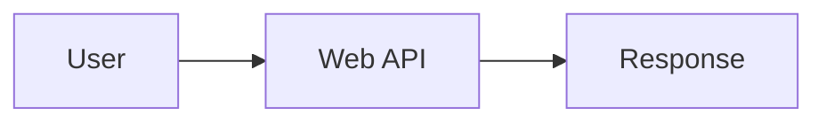

# Feature Guide

This document describes the main authoring features provided by `marp-theme-tmu-cs`.

For day-to-day rendering from another project, the intended entrypoint is the packaged `marp-tmu-cs` wrapper. It supplies the bundled engine and theme CSS automatically unless you override them explicitly.

## Engine Defaults

The custom engine extends normal Marp rendering with document-level defaults.

- it can generate a title slide from front matter
- it can add default `header` and `footer` values when they are omitted
- it can insert automatic section pages
- it can expand explicit TOC slides
- it resolves external code before rendering
- it processes citations before slide rendering
- it expands step-based code slides before final rendering

Typical front matter:

```yaml
---
marp: true
theme: tmu-cs
paginate: true
math: mathjax
title: TMU-CS
subtitle: Marp slides with annotations
author: Your Name
affiliation: Tokyo Metropolitan University
date: 2026-04-20
bibliography: references.bib
---
```

If `header` is not set, the engine builds one from `title / subtitle`. If `footer` is not set, the engine builds one from `author / date`.

Implementation map: `engine.mjs`, `src/pipeline/deck-defaults.mjs`

## Section Pages And TOC Slides

The engine provides deck-structure features beyond standard Marp directives.

Front matter:

```yaml
---
sectionPages: true
sectionPageLevel: 2
tocPageMaxLevel: 2
---
```

Commands:

```md
# Table of contents

<!-- toc -->

---

# Deep TOC Example

<!-- toc level=3 -->
```

Behavior:

- `sectionPages: true` inserts auxiliary section pages automatically
- `sectionPageLevel` chooses which heading level is treated as a section boundary
- section headings used for automatic section pages are absorbed into the section page instead of being left behind as a duplicate heading-only slide
- `tocPageMaxLevel` sets the default maximum heading level included by `<!-- toc -->`
- `<!-- toc level=N -->` overrides the maximum included heading level for one TOC slide
- headings that use the `<!--fit-->` large-type pattern are excluded from generated TOCs
- in HTML output, section pages and TOC pages hide header, footer, and pagination, and they do not increment the visible page count
- normal slides show the current section name on the right side of the header

Implementation map: `src/pipeline/section-pages.mjs`, `src/pipeline/auxiliary-pagination.mjs`

## Annotated And Step-Emphasized Code

The theme uses Shiki for fenced code block highlighting. The package-specific magic-comment flow for code blocks is step-based emphasis on supported languages that have line comments.

Supported line comment prefixes:

- `//`: `c`, `cpp`, `csharp`, `fsharp`, `go`, `java`, `javascript`, `jsx`, `kotlin`, `php`, `rust`, `scala`, `swift`, `typescript`, `tsx`
- `#`: `perl`, `python`, `r`, `ruby`, `shell`, `toml`, `yaml`
- `--`: `lua`, `sql`

### Step-Emphasized Code With `step`

Use the language's supported line comment prefix plus `[!step ...]` to create slide-by-slide emphasis variants.

```cpp
for (int i = 0; i < 10; i++) {  // [!step 1 warning]
  std::cout << i << '\n';       // [!step 2 info]
}
return 0;                       // [!step 3 focus]
```

```python
for i in range(10):   # [!step 1 warning]
    print(i)          # [!step 2 info]
return_value = 0      # [!step 3 focus]
```

Visible comments may be kept before the directive:

```cpp
for (int i = 0; i < 10; i++) {  // loop counter [!step 1 warning]
  std::cout << i << '\n';       // output current value [!step 2 info]
}
```

Syntax:

```text
[!step <number> <highlight|focus|warning|error|info>[:N]]
```

Rules:

- step numbers must be positive integers
- supported actions are `highlight`, `focus`, `warning`, `error`, and `info`
- `:N` expands the effect to multiple code lines
- the directive must appear at the end of the comment; any comment text before it remains visible
- the engine duplicates slides so each step becomes its own revealed state
- as of the current version, code-block `[!annotate]` is no longer supported; use ordinary comments for explanations
- languages without a supported line comment prefix still get Shiki syntax highlighting, but `step` directives are ignored

Implementation map: `src/features/code/index.mjs`, `src/shiki/parse-step-directive.mjs`, `src/features/code/expand-step-slides.mjs`

## External Code Inclusion

Standalone Markdown links can be expanded into fenced code blocks automatically when the language can be inferred from the file extension.

```md
[sample.cpp](cpp/sample.cpp)
```

Notes:

- the link must occupy the whole line
- language can be inferred from the file extension
- the engine also supports fenced blocks with `path=` or `src=` attributes
- fenced external code blocks do not need an explicit fence language when the file extension is known
- add `fit-height="true"` to a fenced block when the rendered code should be scaled to the remaining slide height

Implementation map: `src/features/code/index.mjs`, `src/features/code/resolve-external-code.mjs`

## Diagrams Via Kroki

Kroki-backed diagram languages can be written as normal fenced code blocks without raw HTML.

Mermaid example:

````md

````

Other supported fence languages include `plantuml`, `graphviz`, `dot`, `vega`, `vegalite`, `nomnoml`, and the other Kroki languages listed in `src/features/diagrams/languages.mjs`.

Behavior:

- diagram fences are rendered through a Kroki backend instead of the normal code highlighter
- output uses a remote `https://kroki.io/` image URL with SVG output
- Marp auto-scaling is applied so large diagrams are scaled down to fit the slide area
- no raw HTML is required in Markdown source
- standalone HTML output fetches Kroki SVG diagrams during build and rewrites them to `data:` URLs
- PDF and PPTX output may work when the output pipeline can fetch the remote diagram image, but this is best-effort rather than guaranteed offline behavior
- diagram syntax errors or Kroki availability problems surface as missing images in rendered output

Implementation map: `engine.mjs`, `src/features/diagrams/index.mjs`, `src/features/diagrams/kroki-backend.mjs`

## Media Enhancements

GIF images are wrapped by the custom engine so they do not autoplay by default in HTML output.

- the slide initially shows a still poster frame
- playback starts only after the viewer presses the play button
- once started, the GIF is swapped in as a normal image element

This applies to standard Markdown image syntax when the image source ends with `.gif`.

Audio elements can also opt into a wavegram spectrogram view by adding the `wavesurfer-spectrogram` class.

```html
<audio
  class="wavesurfer-spectrogram"
  controls
  src="../assets/sine-440hz.wav"
  data-spectrogram-height="120"
  data-spectrogram-fft-samples="2048"
></audio>
```

Behavior:

- the original `audio` source remains in the slide, but native browser controls are hidden in favor of `wavegram-player`
- the engine wraps it with a green theme frame and a `wavegram-player` Web Component after HTML rendering
- the wavegram runtime is embedded only when this class is present
- playback, seeking, cursor display, waveform rendering, spectrogram rendering, ready state, and time display follow wavegram defaults
- the theme does not set wavegram visual custom properties or add separate play/stop/status/time controls
- `data-spectrogram-height` and `data-spectrogram-fft-samples` are passed through as `spectrogram-height` and `fft-size` when explicitly present
- local spectrogram audio sources are converted to `data:` URLs during HTML rendering so they still work when the deck is opened directly from disk
- remote audio sources need CORS headers that allow the browser-side analysis fetch

Implementation map: `engine.mjs`, `src/pipeline/animated-images.mjs`, `theme/tmu-cs.css`

## Standalone HTML Asset Bundling

When you build through the packaged `marp-tmu-cs` wrapper with `--standalone`, the engine rewrites local asset references so the output HTML can be shared as a single file.

Typical command:

```bash
npx marp-tmu-cs --standalone slides.md -o slides.html
```

Behavior:

- local `img`, `audio`, `video`, and `source` assets are converted to `data:` URLs
- Kroki-hosted SVG diagram images are fetched during build and converted to `data:` URLs
- local GIF player sources are converted to `data:` URLs after GIF wrapping
- local HTML `iframe` sources are converted to `srcdoc`, and their local scripts, stylesheets, and media references are inlined recursively
- remote URLs such as CDN assets are left unchanged, except for Kroki SVG diagram images
- `--standalone` is intended for HTML output only

Implementation map: `scripts/marp-tmu-cs.mjs`, `engine.mjs`, `src/pipeline/standalone-assets.mjs`

## Math Highlighting And Math Annotations

Display math can be annotated line by line using `% [!math-annotate ...]` comments at the end of TeX lines.

```tex
$$
X_k % [!math-annotate note="The k-th frequency component"]
= \sum_{n=0}^{N-1} % [!math-annotate note="Summation over all samples"]
x_n % [!math-annotate label="signal" note="Discrete-time signal"]
$$
```

Requirements and behavior:

- `math: mathjax` must be enabled in front matter
- `note` is required
- `label` is optional
- `color` is optional and accepts hex-style values
- `:N` is parsed but ignored for math annotations
- the annotation must be placed at the end of the line it describes
- as of the current version, math uses `[!math-annotate ...]` while code-block `[!annotate]` remains removed
- the engine wraps the math block and injects a runtime that places note boxes and connectors

Implementation map: `src/features/math/index.mjs`, `src/features/math/annotate-math-block.mjs`, `engine.mjs`

## Bibliography And Citation Management

The bibliography pipeline is built around the theme's citation syntax plus a BibTeX bibliography file. It is processed entirely in JavaScript using Citation.js and citeproc.

Citation example:

```md
This is a citation [@postel1981ip; @stroustrup2022tour].
```

Front matter:

```yaml
---
bibliography: references.bib
# csl: path/to/style.csl
---
```

Behavior:

- `bibliography:` is required when citation syntax is used
- `csl:` is optional; otherwise the bundled IEEE CSL is used
- cited items are rendered into a footnote-style area on each slide
- Markdown footnotes are merged into the same visual region
- a References slide is populated in place when the slide contains a `::: {#refs}` placeholder
- an otherwise empty `# References` slide is also populated in place
- if no references slide is present, the engine appends one when needed
- DOI and URL metadata are turned into links in bibliography entries

To control the insertion point explicitly, write a references slide like this:

```md
# References

::: {#refs}
:::
```

Dependency note:

- no external citation tool is required

Implementation map: `src/features/citations/index.mjs`, `src/features/citations/core.mjs`, `src/features/citations/backends/js.mjs`, `vendor/csl/ieee.csl`
