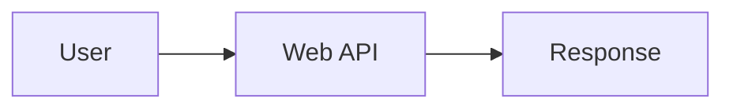
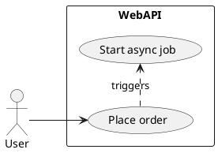
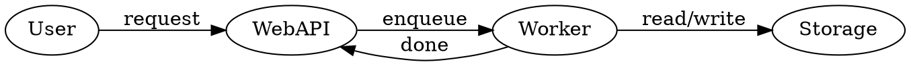

# Table of contents

<!-- toc -->

<!--
This TOC slide is intentionally placed right after the title slide.
Because it is treated as an auxiliary page, it should hide header, footer, and pagination.
-->

---

## Basic usage

<!--
This section covers plain Markdown authoring with the theme: headings, emphasis, lists,
tables, blockquotes, columns, and common embedded media.
-->

---

<!-- _class: column-layout -->

<!--
This slide maps common GitHub-flavored Markdown syntax to the rendered theme output.
Use it to explain the default typography, table styling, lists, blockquotes, and inline footnotes.
-->

### Markdown basics

<div class="column">

| Item | Syntax | Result |
| :--- | :----- | :----- |
| Heading | `# h1`, `## h2`, `### h3` | See the slide structure |
| Bold | `**bold**` | **bold** [^theme-color] |
| Italic | `_italic_` | _italic_ |
| Strike | `~~strike~~` | ~~strike~~ |
| Mark | `<mark>highlight</mark>` | <mark>highlight</mark> |

</div>

<div class="column">

- Unordered list
  - Nested unordered list

1. Ordered list
   1. Nested ordered list

> A regular blockquote

</div>

[^theme-color]: The accent color comes from the Department of Computer Science at Tokyo Metropolitan University (`#006543`).

---

<!--
This slide shows the definition-card pattern implemented through a blockquote whose first line is a level-4 heading.
It is useful for theorem-like callouts, terminology, and compact concept summaries.
-->

### Definition card

> #### Eigenvector
>
> Let $V$ be a vector space and $T: V \to V$ a linear transformation. A nonzero vector $v \in V$ is called an eigenvector of $T$ if there exists a scalar $\lambda$ such that $T(v) = \lambda v$.
> The scalar $\lambda$ is called the corresponding eigenvalue.

---

<!-- _class: column-layout -->

<!--
This slide demonstrates the custom `column-layout` class and the three-column balance used by the theme.
It is the main reference slide for multi-column authoring.
-->

### Column layout

<div class="column">

#### Left

- Background
- Problem setting
- Assumptions

</div>

<div class="column">

#### Center

- Method
- Derivation
- Parameters

</div>

<div class="column">

#### Right

- Results
- Discussion
- Conclusion

</div>

---

<!-- _class: column-layout -->

<!--
This slide collects the supported media primitives: static images, animated GIF playback, plain audio, and spectrogram audio.
Use it to explain the difference between standard HTML media and the theme-specific wavegram integration.
-->

### Media

<div class="column">

- Image: 
- Animated GIF: 
- Plain audio: <audio controls src="https://raw.githubusercontent.com/pdx-cs-sound/wavs/main/voice.wav"></audio>

</div>

<div class="column">

- Spectrogram audio: <audio class="wavesurfer-spectrogram" controls src="https://raw.githubusercontent.com/pdx-cs-sound/wavs/main/voice.wav" data-spectrogram-height="90" data-spectrogram-fft-samples="2048"></audio>

</div>

## Theme-specific directives

<!--
This section introduces the custom front matter directives and inline commands added by this theme package.
It separates deck-structure controls from the rendering features demonstrated later.
-->

---

<!--
This slide summarizes the custom front matter directives provided by the theme engine.
Use it as the quick reference for automatic section pages and table-of-contents depth control.
-->

### Deck-level directives

| Key | Purpose | Typical value |
| :-- | :------ | :------------ |
| `sectionPages` | Insert automatic section pages at the chosen heading level | `true` |
| `sectionPageLevel` | Choose which heading level starts a new section | `2` |
| `tocPageMaxLevel` | Limit how deep `<!-- toc -->` expands by default | `2` or `3` |

```yaml
---
sectionPages: true
sectionPageLevel: 2
tocPageMaxLevel: 2
---
```

---

<!--
This slide explains the inline commands and magic comments interpreted by the custom engine.
It is the main authoring reference for TOC insertion, external code expansion, and step emphasis.
-->

### Inline commands and markers

- `<!-- toc -->`: insert a TOC using the deck default depth
- `<!-- toc level=3 -->`: override the TOC depth for one page
- `<!-- _class: all-text-center align-center -->`: center all text horizontally and place the slide content vertically in the middle
- `[sample.cpp](cpp/sample.cpp)`: expand a standalone code link into a fenced block
- ```` ```cpp path="cpp/sample.cpp" fit-height="true" ````: load external code and scale it to the remaining height
- `// [!step ...]` or `# [!step ...]`: generate step-by-step emphasis slides
- `% [!math-annotate ...]` at the end of a TeX line: attach math annotations

---

## Theme-specific syntax

<!--
This section focuses on authoring features added by this package:
math annotations, step expansion, citations, bibliography placeholders, and large-type slides.
-->

---

<!--
This slide demonstrates inline math, display math, and line-level math annotations rendered by the theme.
The annotation comments are kept in source and turned into visual callouts during preprocessing.
-->

### Math annotations

Inline math: $e^{i\pi} + 1 = 0$

$$
X_k % [!math-annotate note="The $k$-th component in the frequency domain"]
=
\sum_{n=0}^{N-1} % [!math-annotate note="Summation over every sample"]
x_n % [!math-annotate note="Discrete-time signal"]
\exp\!\left( -2\pi i \frac{kn}{N} \right) % [!math-annotate note="Complex rotation factor"]
$$

---

<!--
This slide is the baseline code-highlighting example without external annotations.
It shows that fenced code blocks in multiple languages inherit the same Shiki-based color theme.
-->

### External code and highlighting

- [sample.cpp](cpp/sample.cpp)

```cpp
#include <iostream>
int main() {
    for (int i = 0; i < 5; ++i) { std::cout << i << std::endl; }
    return 0;
}
```

```py
for i in range(5):
    print(i)
```

---

<!--
This slide introduces step-based highlighting on external C++ code.
It is meant to show the source file reference rather than inline code.
-->

### Step-highlighted code

[sample-highlight.cpp](cpp/sample-highlight.cpp)

- Use `// [!step]` in C++ and `# [!step]` in Python
- Supported styles: `highlight`, `focus`, `warning`, `error`, `info`

---

<!--
This slide mirrors the previous one for Python source files.
It highlights that the same step model works across languages with comment-prefix differences only.
-->

### Step-highlighted code in Python

[sample-highlight.py](python/sample-highlight.py)

---

<!--
This is the first step-emphasis slide and introduces the source syntax for progressive code highlighting.
Subsequent slides are generated automatically from the same block to reveal each emphasis state in order.
-->

### Step-based emphasis

```cpp fit-height="true"
#include <iostream>

int main() {
  const int matrix[2][3] = {{1, 2, 3}, {4, 5, 6}};  // input matrix [!step 1 highlight]
  const int vector[3] = {7, 8, 9};                  // input vector [!step 2 highlight]

  for (int row = 0; row < 2; ++row) {                // loop over rows [!step 3 focus:4]
    const int sum = matrix[row][0] * vector[0]
      + matrix[row][1] * vector[1]                   // middle term [!step 4 warning]
      + matrix[row][2] * vector[2];                  // final term [!step 5 error]
    std::cout << sum << '\n';                        // output result [!step 6 info]
  }
}
```

- `// [!step <number> <action>[:N]]` creates slide-by-slide emphasis states

---

<!--
These slides demonstrate Kroki-backed diagram rendering from normal fenced code blocks.
They intentionally avoid raw HTML so the authoring model stays consistent with Markdown-first slides.
-->

### Mermaid flowchart



Write the diagram as a normal fenced code block; the engine renders it through Kroki. See the [official Kroki repository](https://github.com/yuzutech/kroki).

---

<!--
This slide shows that the same pipeline works for non-Mermaid diagram syntaxes supported by Kroki.
-->

### PlantUML diagram



The same pipeline works for other Kroki-supported diagram languages.

---

<!--
This slide adds a Graphviz example so the regression deck covers a third Kroki language family.
-->

### Graphviz diagram



The same pipeline works for other Kroki-supported diagram languages.

---

<!--
This slide demonstrates inline citations and the generated per-slide citation footnotes.
It is the main example for `[@key]` authoring with the bibliography defined in front matter.
-->

### Inline citations

- Core Internet Protocol specification [@postel1981ip]
- A standard C++ textbook [@stroustrup2022tour]

```md
- Core Internet Protocol specification [@postel1981ip]
- A standard C++ textbook [@stroustrup2022tour]
```

---

<!--
This page documents the placeholder syntax.
The actual bibliography is rendered on the final References slide below.
-->

### Reference slide placeholder

```md
# References

::: {#refs}
:::
```

---

<!--
This is the actual bibliography insertion point for the sample deck.
The citation preprocessing stage recognizes the empty references slide and injects the rendered bibliography here.
-->

# References

---

<!--
These slides act as Takahashi-method examples.
They demonstrate how auto-scaling large headlines behave with the theme.
-->

# <!--fit--> Takahashi<br />Method

---

<!--
This slide is a minimal single-word large-type example.
It demonstrates the centered layout and scaling for short emphasis slides.
-->

# <!--fit--> Focus

---

<!--
This slide is another fitted two-line headline and completes the large-type sequence.
It is useful for checking balance, line breaks, and scaling consistency.
-->

# <!--fit--> Huge<br />Words

---

<!-- _class: all-text-center align-center -->

<!--
This slide demonstrates the `all-text-center align-center` class combination inherited from the original theme.
It centers text horizontally and centers the whole slide content vertically, which is useful for credits and closing slides.
-->


Implemented by [OpenAI Codex](https://openai.com/codex/) with prompts from [Taishi Nakashima](https://taishi.org).
Codes are available on [GitHub](https://github.com/taishi-n/marp-theme-tmu-cs)!
